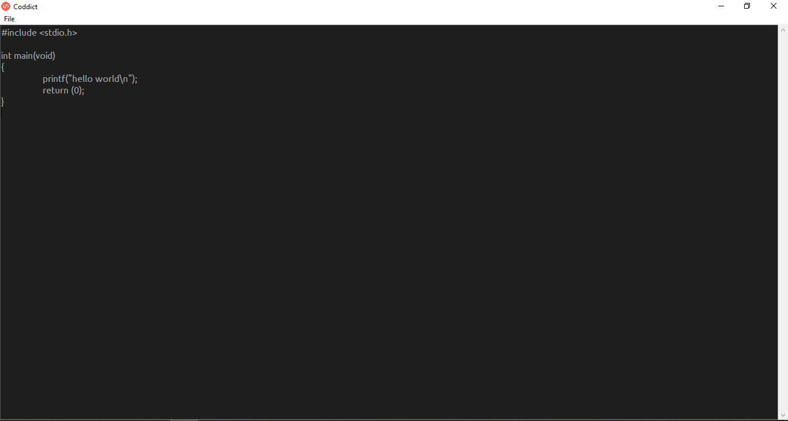

# Coddict

## Description
Simple text editor for python developers.  

## Download

### Licence

### For Windows
Download python3: https://www.python.org/downloads/

### For Linux
Download tkinter: sudo apt-get install python3-tk

### Running
* cd coddict
* python3 ./main.py
