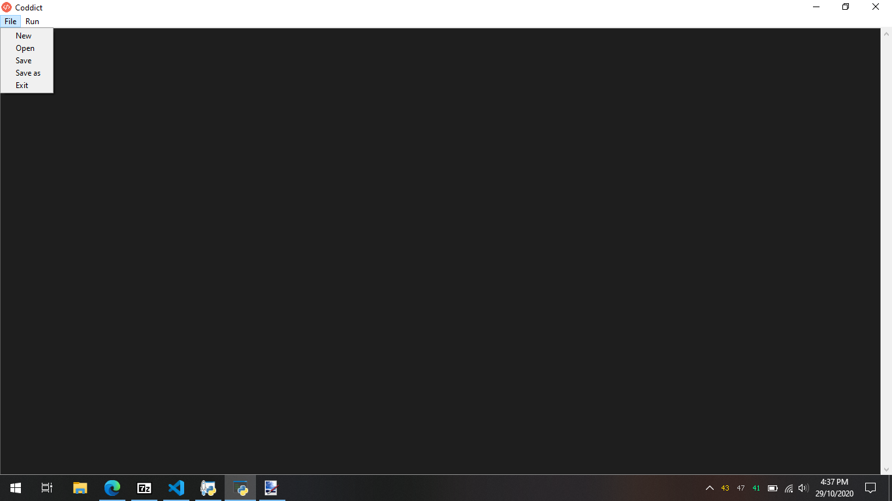
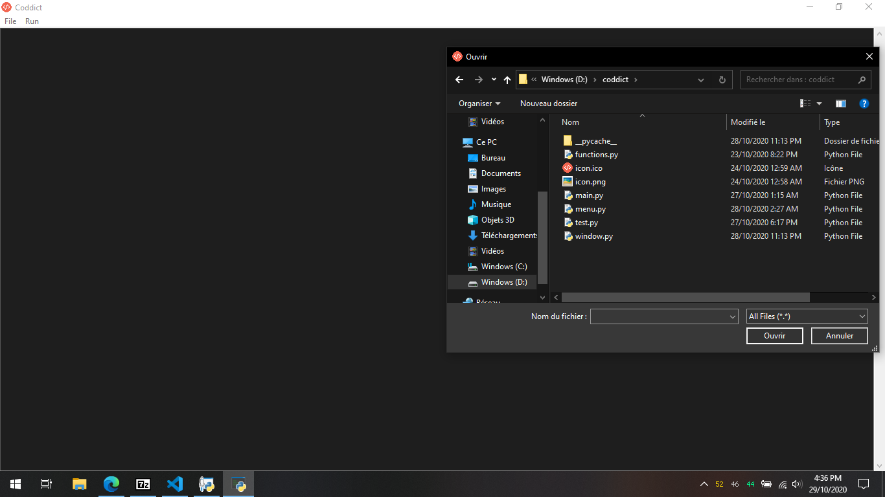
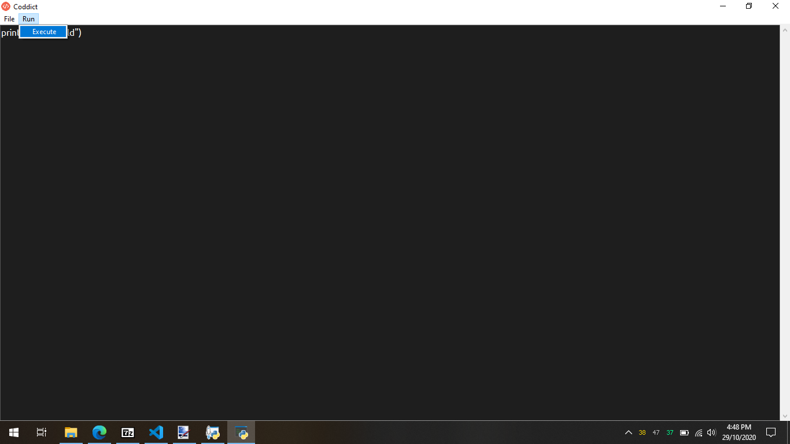

## What is Coddict

Coddict is a simple text editor for pyhton developer.

## Features
###       File management

Coddict gives you the ability to create, open and save a python script.

###       Script execution

To run your script you need just to click on the button Execute

## About
I am karim bahri [Holberton school](https://www.holbertonschool.com/tn/fr) student.
I started this project for the reason that i like create my own tools which serves to automate some repetitive tasks.
I used python for this project specifically tkinter module because it is more flexible than other low level language.
Also python has a vast community worldwide and this can be very useful when you hit a bug.

[Twitter](https://twitter.com/karimba06792328).
[LinkedIn](https://www.linkedin.com/in/karim-bahri-201a5b1a1/).
[Github repository](https://github.com/GEEK1050/Coddict).

## Optional

